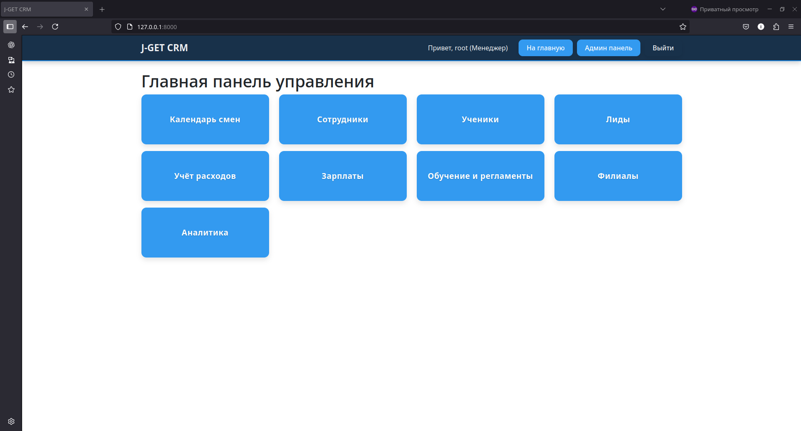
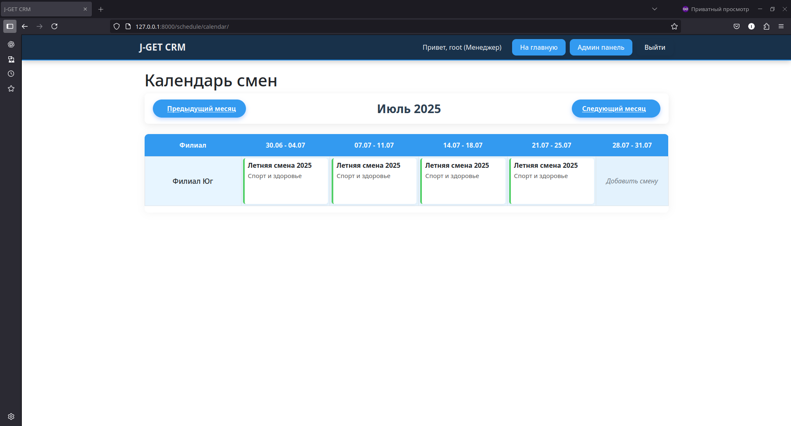
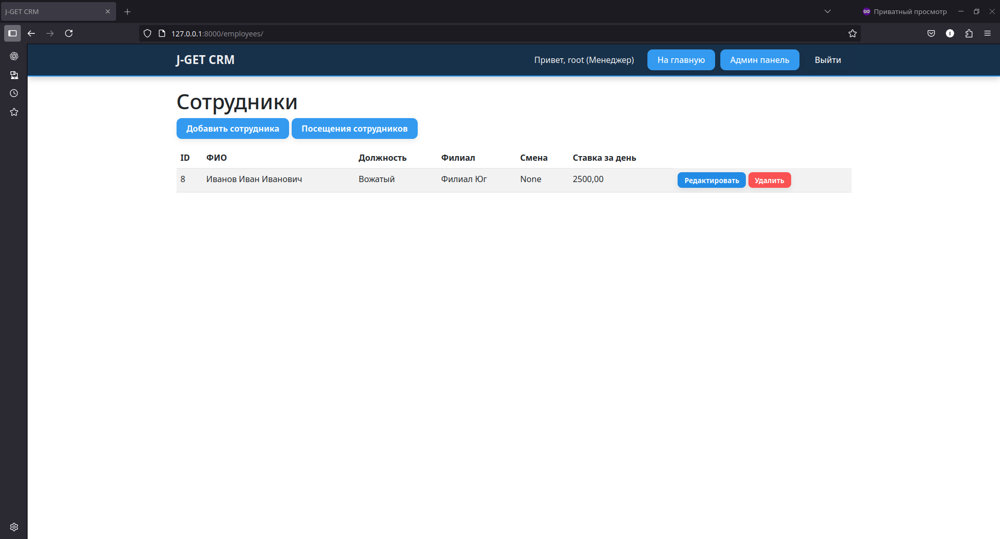
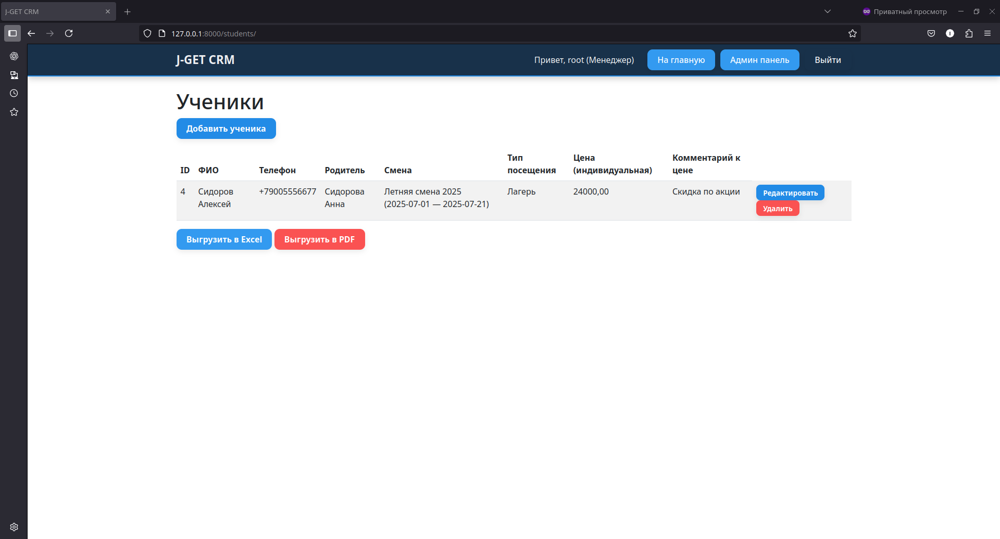

# J-GET CAMP CRM

**J-GET CAMP CRM** — это корпоративная система управления сменами, сотрудниками, учениками, лидами, расходами и обучающими материалами для образовательных лагерей и лабораторий.

---

## Содержание

- [Описание](#описание)
- [Требования](#требования)
- [Установка](#установка)
- [Запуск](#запуск)
- [Структура проекта](#структура-проекта)
- [Основные эндпойнты API](#основные-эндпойнты-api)
- [Примеры запросов](#примеры-запросов)
- [Скриншоты](#скриншоты)
- [Лицензия](#лицензия)

---

## Описание

Система предназначена для автоматизации процессов управления сменами, сотрудниками, учениками, лидами, расходами и обучающими материалами. Поддерживает роли пользователей, разграничение доступа, экспорт данных, работу с календарём смен и многое другое.

---

## Требования

- Python 3.11+
- Django 5.2+
- MySQL
- [См. requirements.txt](./requirements.txt)

---

## Установка

1. Клонируйте репозиторий:
    ```bash
    git clone <URL-ВАШЕГО-РЕПОЗИТОРИЯ>
    cd j_get_camp
    ```

2. Установите зависимости:
    ```bash
    pip install -r requirements.txt
    ```

3. Настройте переменные окружения в `.env` (пример уже есть в проекте).

4. Примените миграции:
    ```bash
    python manage.py migrate
    ```

5. (Опционально) Загрузите тестовые данные:
    ```bash
    python manage.py loaddata mok_data_fixtures/mock_data.json
    ```

6. Создайте суперпользователя:
    ```bash
    python manage.py createsuperuser
    ```

---

## Запуск

```bash
python manage.py runserver
```

## Структура проекта

- branches/
- core/
- education/
- employees/
- leads/
- payroll/
- schedule/
- students/
- templates/
- static/
- manage.py
- requirements.txt

## Основные эндпойнты API

Все API доступны по префиксу:  
`/api/`

### Авторизация
- `POST /api/auth/login/` — **Вход пользователя**
- `POST /api/auth/logout/` — **Выход пользователя**

### Филиалы
- `GET /api/branches/` — **Получить список филиалов**
- `POST /api/branches/` — **Создать филиал**
- `GET /api/branches/{id}/` — **Получить филиал по ID**
- `PUT /api/branches/{id}/` — **Обновить филиал**
- `DELETE /api/branches/{id}/` — **Удалить филиал**

### Смены (Schedule)
- `GET /api/schedule/` — **Получить список смен**
- `POST /api/schedule/` — **Создать смену**
- `GET /api/schedule/{id}/` — **Получить смену по ID**
- `PUT /api/schedule/{id}/` — **Обновить смену**
- `DELETE /api/schedule/{id}/` — **Удалить смену**

### Сотрудники
- `GET /api/employees/` — **Получить список сотрудников**
- `POST /api/employees/` — **Создать сотрудника**
- `GET /api/employees/{id}/` — **Получить сотрудника по ID**
- `PUT /api/employees/{id}/` — **Обновить сотрудника**
- `DELETE /api/employees/{id}/` — **Удалить сотрудника**

#### Посещения сотрудников
- `GET /api/employees/attendances/` — **Получить список посещений**
- `POST /api/employees/attendances/` — **Добавить посещение**
- `PUT /api/employees/attendances/{id}/` — **Обновить посещение**
- `DELETE /api/employees/attendances/{id}/` — **Удалить посещение**

### Ученики
- `GET /api/students/` — **Получить список учеников**
- `POST /api/students/` — **Создать ученика**
- `GET /api/students/{id}/` — **Получить ученика по ID**
- `PATCH /api/students/{id}/` — **Частично обновить ученика**
- `DELETE /api/students/{id}/` — **Удалить ученика**

### Лиды
- `GET /api/leads/` — **Получить список лидов**
- `POST /api/leads/` — **Создать лида**
- `GET /api/leads/{id}/` — **Получить лида по ID**
- `PUT /api/leads/{id}/` — **Обновить лида**
- `DELETE /api/leads/{id}/` — **Удалить лида**

### Расходы и зарплаты
- `GET /api/payroll/expenses/` — **Получить список расходов**
- `POST /api/payroll/expenses/` — **Добавить расход**
- `DELETE /api/payroll/expenses/{id}/` — **Удалить расход**
- `GET /api/payroll/salaries/` — **Получить список зарплат**
- `POST /api/payroll/salaries/` — **Добавить зарплату**
- `PUT /api/payroll/salaries/{id}/` — **Обновить зарплату**
- `DELETE /api/payroll/salaries/{id}/` — **Удалить зарплату**

### Обучающие материалы (регламенты)
- `GET /api/education/regulations/` — **Получить список регламентов**
- `POST /api/education/regulations/` — **Создать регламент**
- `GET /api/education/regulations/{id}/` — **Получить регламент по ID**
- `PUT /api/education/regulations/{id}/` — **Обновить регламент**
- `DELETE /api/education/regulations/{id}/` — **Удалить регламент**

## Примеры запросов

### Пример: Создание смены с цветом

```bash
curl -X POST http://localhost:8000/api/schedule/ \
  -H "Content-Type: application/json" \
  -d '{
    "name": "Летняя смена",
    "branch_id": 1,
    "start_date": "2025-07-01",
    "end_date": "2025-07-15",
    "theme": "Лето и спорт",
    "color": "#ff6b6b"
  }'
```

### Пример: Получить список сотрудников
```bash
curl -X GET http://localhost:8000/api/employees/
```

### Пример: Авторизация
```bash
curl -X POST http://localhost:8000/api/auth/login/ \
  -H "Content-Type: application/json" \
  -d '{"username": "manager", "password": "password"}'
```

## Скриншоты

- Главная панель



- Календарь смен



- Список сотрудников



- Ученики

